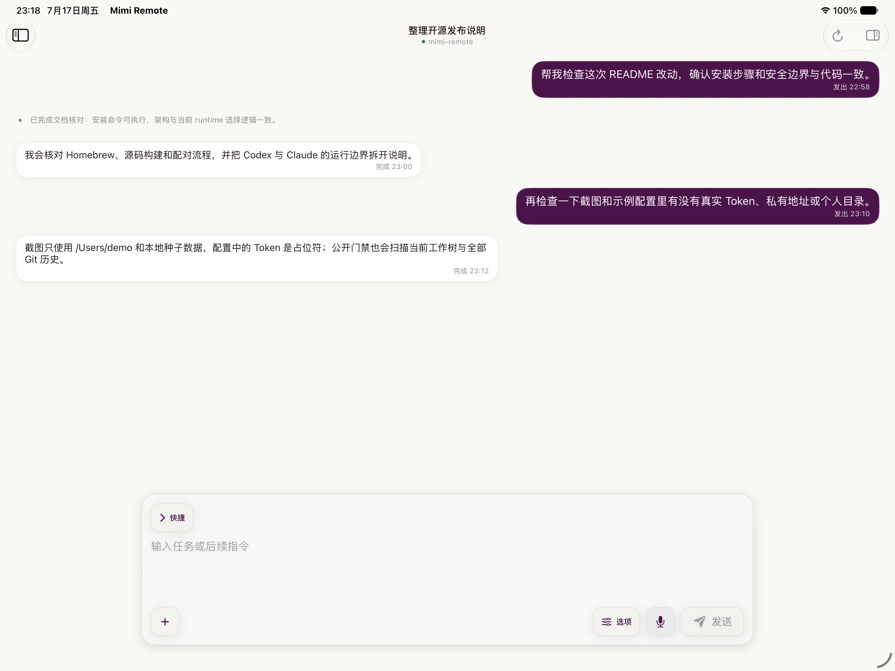
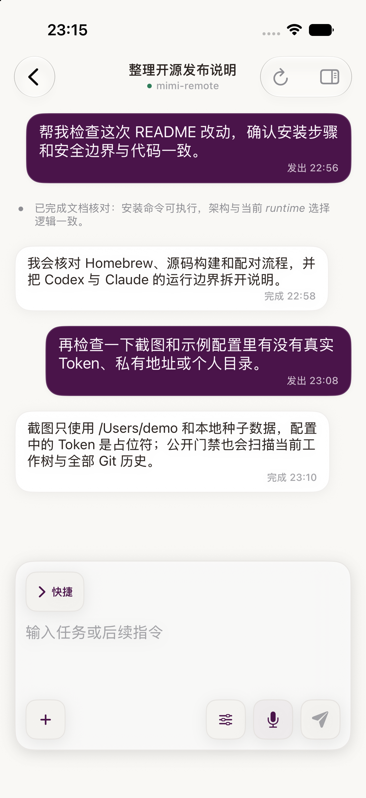
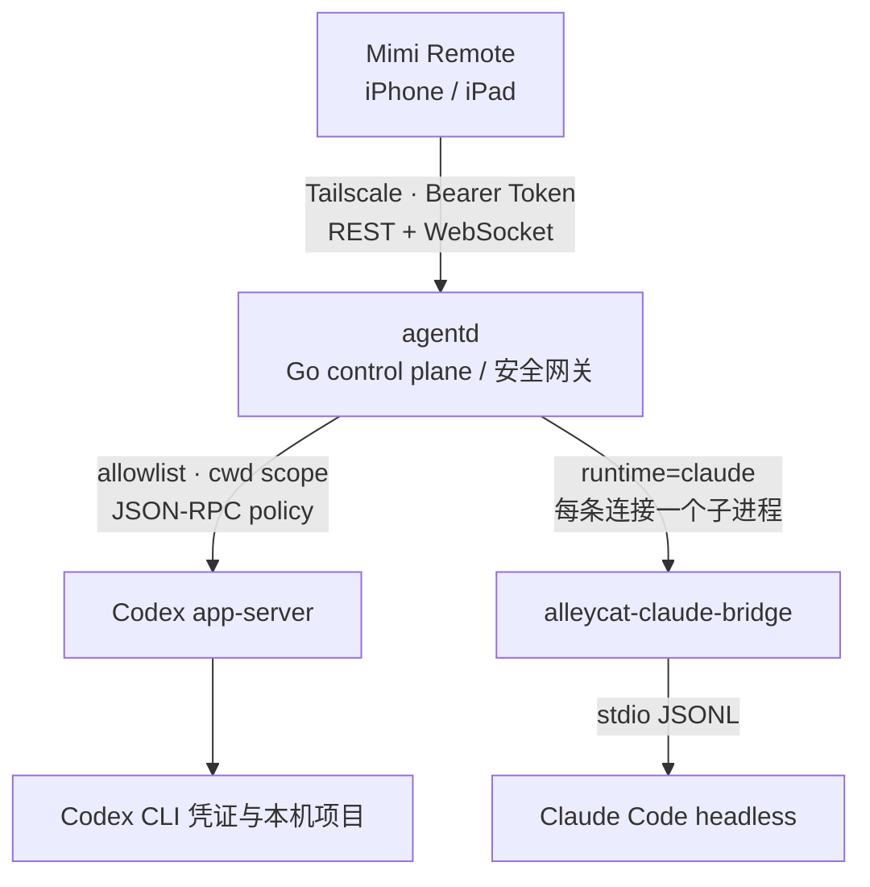

# Mimi Remote

Mimi Remote 是一个开源的原生 iPhone / iPad 远程开发工作台。它通过 Tailscale 连接用户自己 Mac 上的 `agentd`，在明确授权的工作区内使用 Codex；Claude Code 通过可选的独立 bridge 作为实验通道接入。

项目坚持本地优先：代码、Codex / Claude 凭证和完整会话都留在用户自己的开发机上，不经过 Mimi Remote 云服务。

> Mimi Remote 是独立开发的第三方客户端，不隶属于 OpenAI、Anthropic 或 Tailscale，也不代表这些公司的官方产品。

## 截图

| iPad 工作台 | iPhone 会话 |
| --- | --- |
|  |  |

截图使用 Debug 种子数据生成，只用于展示界面，不代表真实后端连接，也不包含真实 Token、Tailscale 地址或用户项目内容。完整采集说明见 [截图清单](artifacts/app-screenshots/manifest.md)。

## 能做什么

- 原生 iPhone / iPad SwiftUI 工作台，支持深浅色、主题、字体和自适应布局。
- Codex 会话列表、搜索、新建、恢复、流式输出、steer、interrupt、审批、目标、Review、fork 和 archive。
- Managed Worktree 创建、分支选择、受保护删除和人工清理。
- Git status、diff、文件与 hunk 级 stage/unstage/revert、commit、push 和草稿 PR。
- 图片、富 Markdown、语音转写、文件安全读取和 Quick Look。
- 多台 Mac 档案，每台使用独立 Keychain Token；同一时间只连接一台。
- Doctor、readyz、弱网恢复、协议漂移检查和安装/回滚工具。
- 可选 Claude Code 实验通道，共用同一套移动端会话和审批界面。

当前不做云端账号、代码托管、公网中继、任意远程 Shell、后台无人值守删除或多用户共享。完整边界见 [项目现状](docs/project-status.md)。

## 架构



安全边界：

- iOS 只保存访问 `agentd` 的外侧 Token，Token 存在 Keychain。
- `agentd` 只允许配置中的项目、`browse_roots` 和受管 Worktree。
- Codex app-server capability token 只保存在 Mac 的 loopback 环境。
- 远程命令只允许执行配置中的 action，并带确认、超时和输出上限。
- 默认只建议通过 Tailscale 私网访问，不建议把 `agentd` 暴露到公网。

### Claude Code 为什么需要单独 bridge

Claude bridge 位于独立仓库 [gaixianggeng/alleycat](https://github.com/gaixianggeng/alleycat)，本仓库不复制或 vendoring 它。`agentd` 为每条 Claude WebSocket 启动一个 `alleycat-claude-bridge` 子进程，把 iOS 使用的 app-server JSON-RPC 转成 Claude Code headless 的 stdio JSONL。

该通道默认关闭并标记为实验功能：断网、锁屏或 WebSocket 结束会终止对应 bridge，正在执行的 turn 可能中断；`goal`、`archive` 和 `fork` 尚未开放。详细生命周期、权限和失败模式见 [Claude bridge 架构](docs/claude-bridge-architecture.md)。

## 快速开始

### 1. Mac 安装

要求：

- 已安装并登录 Codex CLI；
- Mac 与 iPhone / iPad 已加入同一个 Tailscale 网络；
- macOS 已安装 Homebrew。

```bash
brew update
brew install gaixianggeng/tap/mimi-remote

codex --version
codex app-server --help
agentd up
```

`agentd up` 会生成用户私有配置和两层独立 Token，启动后台服务，等待真实 app-server WebSocket 就绪，然后在终端显示短期配对二维码。

常用命令：

```bash
agentd status
agentd pair
agentd doctor --fix
agentd logs -n 200
agentd restart
agentd stop
```

Linux 使用 Release 归档中的 user-systemd 安装脚本，完整步骤见 [安装、升级与回滚](docs/install-upgrade-rollback.md)。

### 2. 安装 iOS App

公开 App Store 版本尚未发布。目前可以从源码构建：

```bash
xcodegen generate \
  --spec ios/MimiRemote/project.yml \
  --project ios/MimiRemote

open ios/MimiRemote/MimiRemote.xcodeproj
```

在 Xcode 中选择 `MimiRemote` scheme、开发者 Team 和目标 iPhone / iPad 后运行。工程要求 iOS / iPadOS 26 或更高版本。

首次启动时扫描 `agentd up` 或 `agentd pair` 显示的二维码。二维码使用短期、单次兑换票据，不直接包含长期 Token；扫码不可用时可以展开高级手动连接。

## Claude Code 实验通道

当前要求 `alleycat-claude-bridge >= 0.2.1`。安装固定到已审阅 revision：

```bash
cargo install --git https://github.com/gaixianggeng/alleycat.git \
  --rev 1bb754687990a308dcc330f369820ff42d7c3289 \
  --locked --force alleycat-claude-bridge

command -v alleycat-claude-bridge
```

在用户配置中显式启用：

```json
{
  "claude": {
    "enabled": true,
    "bridge_bin": "/opt/homebrew/bin/alleycat-claude-bridge",
    "args": [],
    "max_concurrent_bridges": 3,
    "env": {
      "TERM": "xterm-256color"
    }
  }
}
```

然后验证：

```bash
agentd restart
agentd doctor

go run ./scripts/ipad-ws-probe.go \
  -endpoint http://127.0.0.1:8787 \
  -token "$AGENTD_TOKEN" \
  -cwd "$PWD" \
  -runtime claude \
  -models-only
```

## 从源码开发

### Go 后端

要求 Go `1.25.0`：

```bash
go test ./...
go vet ./...
go build -trimpath -o bin/agentd ./cmd/agentd

./bin/agentd setup --scan-root "$HOME/code" --browse-root "$HOME"
./bin/agentd serve
```

### iOS

```bash
xcodegen generate \
  --spec ios/MimiRemote/project.yml \
  --project ios/MimiRemote

xcodebuild \
  -project ios/MimiRemote/MimiRemote.xcodeproj \
  -scheme MimiRemote \
  -configuration Debug \
  -sdk iphoneos \
  CODE_SIGNING_ALLOWED=NO \
  build-for-testing
```

iOS 工程结构、Catalyst 和真机验收见 [iOS 开发说明](ios/MimiRemote/README.md)。

## 验证

提交前至少运行：

```bash
go test ./... -count=1
go vet ./...
bash ./scripts/check-codex-protocol.sh
bash ./scripts/check-public-repo-safety.sh
bash ./scripts/check-third-party-notices.sh
bash ./scripts/check-ios-privacy-manifest.sh
bash ./scripts/verify-release.sh
```

发布链路另外包含打包、Linux 安装、Git 历史凭据扫描、Action SHA 固定和协议漂移门禁，详见 [P0 / P1 发布清单](docs/p0-p1-roadmap.md)。

## 仓库说明

- 本仓库 `gaixianggeng/codex-ipad-agent`：完整开源源码，包括 iOS App、Go `agentd`、测试、文档和本地发布脚本。
- [gaixianggeng/mimi-remote](https://github.com/gaixianggeng/mimi-remote)：后端公开发布镜像，承载 Go Release 和 Homebrew 下载链路。
- [gaixianggeng/alleycat](https://github.com/gaixianggeng/alleycat)：可选 Claude Code bridge，独立版本和发布周期。

保留后端发布镜像是为了不破坏已有 Homebrew / Release URL；日常功能开发以本仓库为准，后端镜像由白名单脚本单向导出。

## 文档

- [项目现状与关键决策](docs/project-status.md)
- [P0 / P1 发布清单](docs/p0-p1-roadmap.md)
- [安装、升级与回滚](docs/install-upgrade-rollback.md)
- [Tailscale 与 Peer Relay 运维](docs/tailscale-peer-relay-ops.md)
- [Codex 协议支持边界](docs/codex-protocol-support.md)
- [Claude bridge 架构](docs/claude-bridge-architecture.md)
- [与 Litter 的能力对照](docs/litter-comparison.md)
- [隐私政策](docs/privacy-policy.md)
- [安全政策](SECURITY.md)

## 隐私与安全

Mimi Remote 不包含广告、分析 SDK 或开发者自建遥测，不把项目内容、对话、日志、代码或 Token 上传到项目维护者服务器。用户主动启用的 Codex、Claude Code、GitHub、语音或 MCP 等第三方能力仍受各自服务条款约束。

请不要在公开 Issue、PR、日志或截图中提交真实 Token、Tailscale IP、私有工作目录或项目内容。安全问题请按 [SECURITY.md](SECURITY.md) 私下报告。

## License

Mimi Remote 的 iOS App、Go 后端和本仓库自有代码均使用 [MIT License](LICENSE)。第三方版权与许可证正文见 [NOTICE.md](NOTICE.md) 和 [THIRD_PARTY_NOTICES.md](THIRD_PARTY_NOTICES.md)。
