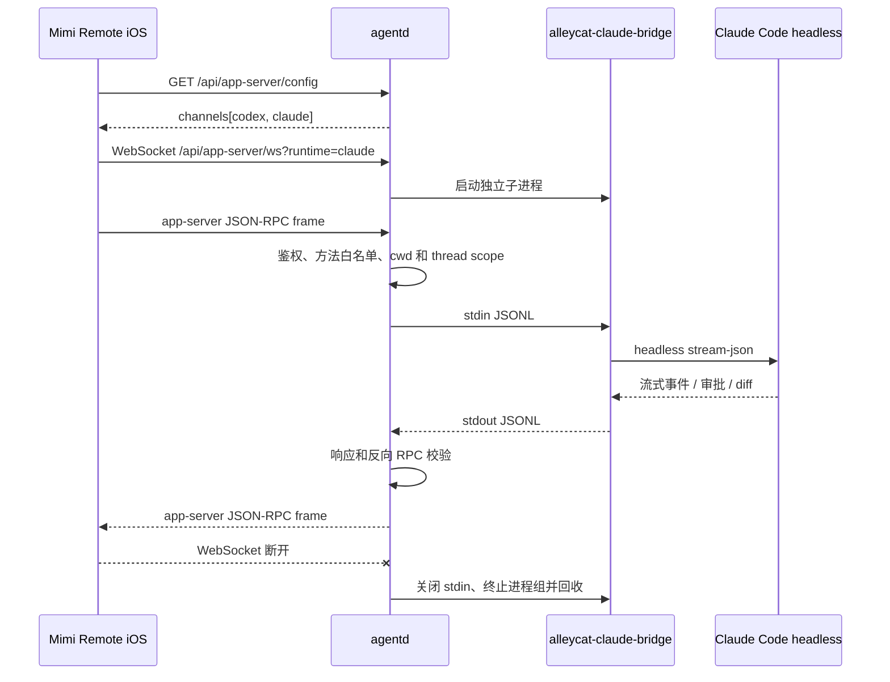

# Claude bridge 架构

更新日期：2026-07-17

## 目标

Claude Code 实验通道让 Mimi Remote 在不复制第二套 iOS 会话 UI、不把 Claude 凭证带到移动端的前提下，复用现有 app-server JSON-RPC 客户端和 `agentd` 安全边界。

bridge 由独立仓库 [gaixianggeng/alleycat](https://github.com/gaixianggeng/alleycat) 提供。本仓库只负责探测、启动、约束和回收 `alleycat-claude-bridge` 子进程。

## 方案

### 组件职责

| 组件 | 职责 | 不负责 |
| --- | --- | --- |
| Mimi Remote iOS | runtime 选择、会话 UI、流式消息、审批交互、本地状态 | 不保存 Claude 登录凭证，不直接启动 Claude CLI |
| `agentd` | Bearer 鉴权、目录授权、方法白名单、版本探测、并发限制、进程回收和观测 | 不翻译 Claude 私有协议，不托管用户会话到云端 |
| `alleycat-claude-bridge` | app-server JSON-RPC 与 Claude Code headless stdio JSONL 互转 | 不监听公网端口，不持有 iOS Token |
| Claude Code | 模型调用、本机登录态、会话和工具执行 | 不直接接受移动端网络连接 |

## 实现

### 生命周期

- `claude.enabled=false` 是默认状态，配置接口只返回 Codex channel。
- 启用后，`agentd` 用 `--version` 探测 bridge；低于 `0.2.1`、无标准版本或二进制不存在时 fail closed。
- 每条 Claude WebSocket 对应一个 bridge 子进程，`lifecycle=per_connection`。
- 默认最多同时运行 3 个 bridge，可用 `max_concurrent_bridges` 收窄。
- WebSocket、stdin、stdout、bridge 进程任一侧结束都会取消本轮连接并回收整个进程组。
- iOS 锁屏、切后台或网络中断会断开 WebSocket，因此正在运行的 turn 可能中断；客户端会进入失败/中断状态，用户可以重新发送。

### Tool 调用与权限

- iOS 与 `agentd` 之间仍使用结构化 JSON-RPC，不传递无边界 prompt blob 作为控制协议。
- `agentd` 对 Claude 使用比 Codex 更小的独立方法白名单。
- thread、cwd、项目、`browse_roots` 和 managed Worktree 继续使用同一套授权投影。
- 审批反向 RPC 必须与待处理请求匹配；未知反向请求 fail closed。
- Claude channel 只声明 `read-only` 和 `workspace-write` sandbox，不声明移动端 `danger-full-access`。
- 网络默认关闭，不开放 `bypass permissions`，不提供任意 SSH 或 Shell 入口。

### 状态与上下文

- iOS 保存界面状态、轻量会话索引和当前 Mac 档案；Token 保存在 Keychain。
- `agentd` 只在内存中维护当前 WebSocket 的授权 thread、pending request、运行计数和最近诊断样本。
- bridge 的协议输入输出是逐行 JSON；`agentd` 不把整段上下文重新拼成额外提示词。
- Claude Code 登录态和可恢复历史由用户本机 Claude Code 环境管理，不上传到 Mimi Remote 服务器。

### 观测与恢复

- `/api/app-server/config.channels[]` 返回 bridge 路径、版本、健康状态、最低版本和修复命令。
- `agentd doctor` 检查二进制、标准版本和最低兼容版本。
- Gateway 记录有界的连接时长、字节数、策略错误和关闭原因，不记录 Token、prompt 或私有文件内容。
- bridge 非预期退出时返回结构化 `CLAUDE_BRIDGE_EXITED`，不会把半健康连接继续留给客户端。
- 没有跨连接自动重试正在运行的 turn，避免断线后重复执行写操作。

### 成本控制

- 并发进程上限默认 3，避免一台开发机被大量连接拖垮。
- 不建设云端 relay、模型代理或共享账号，因此项目本身不承担 Claude token 成本。
- 客户端只展示 Claude Code headless 实际提供的额度信息；拿不到百分比时明确显示不可用，不抓取 Anthropic 私有网页接口，也不把缺失值伪造成 `0%`。

## 风险与优化

- `per_connection` 简单、可观测、易回收，但弱网下不如常驻 daemon 稳定。
- Claude Code headless 协议和事件字段可能变化，需要 bridge 版本门禁与兼容测试持续跟进。
- 当前不支持 `goal`、`archive`、`fork`，也没有后台 push 和跨设备离线同步。
- 如果真实用户需要更稳定的后台任务，优先增加可恢复 run record 和显式重连，而不是直接引入云端编排或无限自动重试。
